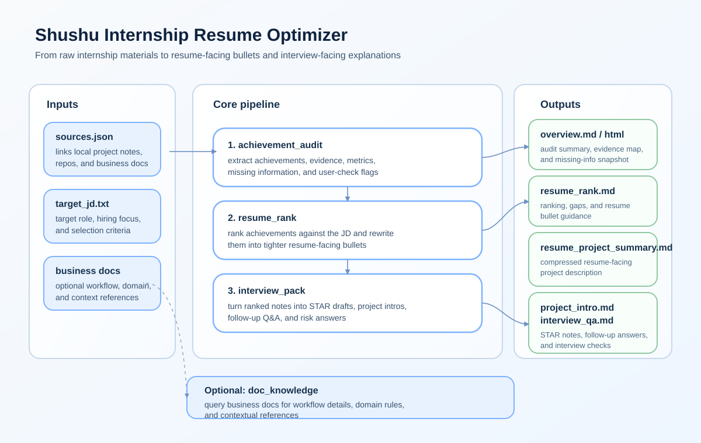

# Shushu Internship Resume Optimizer

Turn internship code repos, project notes, and business context into resume-ready bullets and interview-ready project narratives.

[简体中文](./README.md) · [English](./README.en.md) · [Contributing](./CONTRIBUTING.md) · [Release Notes](./RELEASE_NOTES.md)

## Quick Links

- Want the big picture first: see the workflow diagram below
- Want to try it immediately: go to `3-Minute Demo`
- Want to plug in your own materials: go to `CLI Usage`
- Want the latest project summary: see [Release Notes](./RELEASE_NOTES.md)

## At A Glance



## Highlights

- multi-source input: code repos, project notes, and business docs
- explicit risk surfacing for AI-heavy, repetitive, or overclaimed phrasing
- dual-purpose outputs for self-review, resume compression, and interview prep
- public demo inputs included for fast onboarding

## What This Project Is

This repository is for interns and early-career candidates who want to turn ongoing work into clearer application materials.

It is not a one-click resume generator. The main idea is to audit raw materials first, surface evidence and risks, rank what matters for a target JD, and then generate outputs that are easier to verify and rewrite manually.

The intended workflow is to audit raw materials first, verify the output manually, and only then compress the result into a resume-facing version.

## Core Capabilities

- audit multi-source internship materials: `code_repo`, `project_summary`, `business_docs`
- merge raw materials into achievement candidates with evidence, business context, metrics, and missing information
- rank achievements against a target JD and generate resume-facing bullet suggestions
- flag AI-heavy, repetitive, potentially overclaimed, or user-check-required phrasing
- separate long-form self-review notes from concise resume-facing project summaries
- generate STAR drafts, project intros, interview Q&A, risk answers, and an application checklist

## 3-Minute Demo

The repository includes a small public example input set so you can validate the commands and output structure before plugging in your own local materials.

This example is mainly a public demo input for understanding the structure and running the workflow end to end. For your own project write-up, quantified results, evidence quality, and claim boundaries are still critical.

Example files:

- `examples/minimal_input/sources.json`
- `examples/minimal_input/project_summary.md`
- `examples/minimal_input/business_overview.md`
- `examples/minimal_input/target_jd.txt`

Quick run:

```bash
cd shushu-internship-resume-optimizer
python -m venv .venv
. .venv/bin/activate
python -m pip install -e ".[dev]"
```

PowerShell:

```powershell
.\.venv\Scripts\Activate.ps1
python -m pip install -e ".[dev]"

python -m shushu_internship_tool.achievement_audit \
  --sources examples/minimal_input/sources.json \
  --out demo_reports/audit \
  --name demo-materials

python -m shushu_internship_tool.resume_rank \
  --jd examples/minimal_input/target_jd.txt \
  --achievements demo_reports/audit/achievement_audit.json \
  --target-role llm-application-intern \
  --out demo_reports/rank

python -m shushu_internship_tool.interview_pack \
  --project-notes demo_reports/rank/resume_rank.json \
  --target-role llm-application-intern \
  --out demo_reports/interview
```

If you use `cmd.exe`, activate with `.\.venv\Scripts\activate.bat` first.

Suggested first files to inspect:

- `demo_reports/audit/overview.md`
- `demo_reports/rank/resume_rank.md`
- `demo_reports/rank/resume_project_summary.md`
- `demo_reports/interview/project_intro.md`
- `demo_reports/interview/interview_qa.md`

## Workflow

`JD + multi-source internship materials -> achievement_audit -> resume_rank -> interview_pack`

Optional enhancement:

`business_docs -> doc_knowledge`

Suggested order:

1. Prepare a `sources.json` file with repo paths, project notes, and business docs.
2. Run `achievement_audit` to inspect extracted achievements, evidence, and risk flags.
3. Run `resume_rank` to see which achievements best match the target role.
4. Run `interview_pack` to convert the results into interview material.

## Installation

```bash
cd shushu-internship-resume-optimizer
python -m venv .venv
. .venv/bin/activate
python -m pip install -e ".[dev]"
```

## CLI Usage

If you already have your own local materials prepared, the most common end-to-end flow is:

```bash
python -m shushu_internship_tool.achievement_audit --sources your_materials/sources.json --out reports/audit --name internship-materials
python -m shushu_internship_tool.resume_rank --jd your_materials/target_jd.txt --achievements reports/audit/achievement_audit.json --target-role llm-application-intern --out reports/rank
python -m shushu_internship_tool.interview_pack --project-notes reports/rank/resume_rank.json --target-role llm-application-intern --out reports/interview
```

Where:

- `--sources` points to your `sources.json` input bundle
- `--jd` points to the target job description text file
- `--achievements` usually points to the previous `achievement_audit.json`
- `--project-notes` usually points to `resume_rank.json`, but can also use the audit JSON directly
- `--out` is the output directory for each stage

If you also want a lightweight query layer for business documents, run:

```bash
python -m shushu_internship_tool.doc_knowledge --docs your_materials/business_overview.md --mode basic_rag --query "What are the main failure modes?" --out reports/knowledge
```

## What You Get

After running the main flow, the most useful outputs are usually:

- `overview.md / overview.html`: achievement extraction, evidence, gaps, and risk flags
- `resume_rank.md`: what is worth keeping for the current target role
- `resume_project_summary.md`: a tighter base for manual resume compression
- `project_intro.md / interview_qa.md`: material for project explanation and interview review

A practical order is: inspect `overview` first, then `resume_rank`, and only then use the interview-pack outputs for speaking practice.

## Command Details

### 1. Achievement Audit

```bash
python -m shushu_internship_tool.achievement_audit --sources your_materials/sources.json --out reports/audit --name internship-materials
```

Outputs:

- `achievement_audit.json`
- `overview.md`
- `overview.html`
- `business_context_rewrite.md`

This stage also handles:

- splitting a long project summary into multiple achievement candidates
- extracting metrics, evidence, risks, and missing support
- adding `user_check_flags` for AI-heavy, unclear-boundary, or likely-overclaimed statements
- generating a cleaner business-context rewrite for self-review and interview prep

### 2. Resume Ranking

```bash
python -m shushu_internship_tool.resume_rank --jd your_materials/target_jd.txt --achievements reports/audit/achievement_audit.json --target-role llm-application-intern --out reports/rank
```

Outputs:

- `resume_rank.json`
- `resume_rank.md`
- `resume_project_summary.md`

This stage also suggests:

- more resume-like bullet wording
- which metrics are most worth adding
- what evidence or implementation detail is still missing
- which lines sound too mechanical, repetitive, or overly AI-generated

### 3. Business Doc Knowledge Layer

```bash
python -m shushu_internship_tool.doc_knowledge --docs your_materials/business_overview.md --mode basic_rag --query "How does the workflow recover failures?" --out reports/knowledge
```

Supported modes:

- `direct`
- `basic_rag`
- `knowledge_base`

### 4. Interview Pack

```bash
python -m shushu_internship_tool.interview_pack --project-notes reports/rank/resume_rank.json --target-role llm-application-intern --out reports/interview
```

Outputs:

- `interview_pack.json`
- `resume_star.md`
- `project_intro.md`
- `interview_qa.md`
- `risk_answers.md`
- `application_checklist.md`

## Outputs

The `your_materials/` paths in the commands above are placeholders. This repository does not ship private input materials, so you should replace them with your own local `sources.json`, JD, and business-doc paths.

For a minimal public template, see [examples/minimal_input](./examples/minimal_input/).

- `business_context_rewrite.md`: better for self-review and interview framing
- `resume_rank.md`: better for ranking, risks, and next-step strengthening
- `resume_project_summary.md`: better for concise resume-facing project descriptions
- `interview_qa.md`: better for fast interview review

In practice, it is usually better to feed the tool a longer raw project summary, then manually verify and compress the result, instead of pasting the long summary directly into a resume.

## Design Principles

- do not fabricate metrics
- make missing evidence explicit
- value business context, not just code
- calibrate writing style to the target role
- explicitly warn about AI-heavy or overclaimed phrasing
- optimize for material that is usable in applications, interviews, and follow-up questions

## Credits And Upstream

This repository is a scenario-focused secondary development / restructuring built on top of the original project, with the current version centered on internship resume preparation and interview review.

The current primary flow is:

`achievement_audit -> resume_rank -> interview_pack`

Optional supporting capability:

`doc_knowledge`

Thanks to the original project author for the upstream workflow and foundation. Upstream repository:

- `https://github.com/LiuMengxuan04/shushu-internship-tool`

## Current Status

This project is still under active development.

So far, parts of the workflow have been validated with real internship materials, especially the achievement audit, resume ranking, project intro, and interview Q&A flows. Some features, such as the knowledge-layer / knowledge-base related functions, still need broader testing.

Many rules and generation strategies in this repository would benefit from more real materials and broader edge-case coverage. Feel free to try it with your own sanitized materials and share suggestions.

## Local Checks

This public repository no longer ships the private test samples by default. If you keep your own local tests, you can still run `pytest`.

For a public smoke test, run the `examples/minimal_input` demo flow above.

## Contributing

Contributions are welcome.

If you want to improve extraction quality, resume rewriting, interview phrasing, testing coverage, or docs, please read [CONTRIBUTING.md](./CONTRIBUTING.md) first. Issues and PRs are both welcome.

## Security Reminder

When using this project with internship materials, project notes, or business documents, please follow your company's security and confidentiality rules carefully.

In particular, do not upload, commit, or publish:

- non-anonymized internal business data
- internal company documents, strategies, or workflow details
- materials containing user data, credentials, keys, or tokens
- any internship content that is explicitly not allowed to be shared externally

If you want to test the project, it is strongly recommended to use sanitized materials or manually rewritten summaries first.
